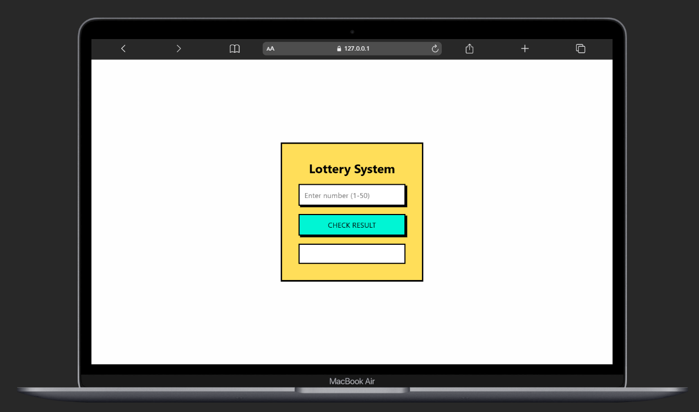
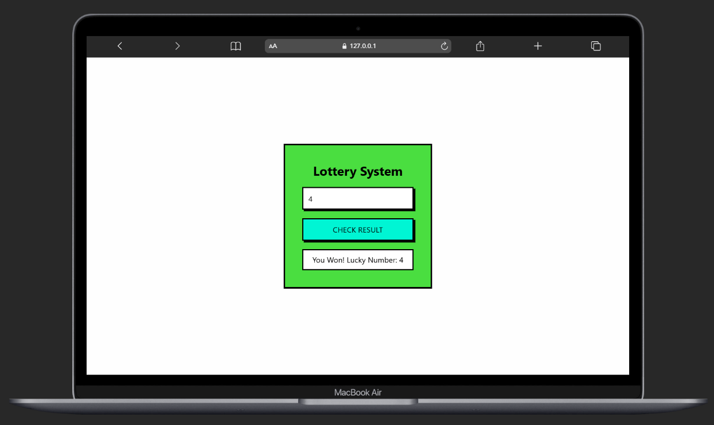
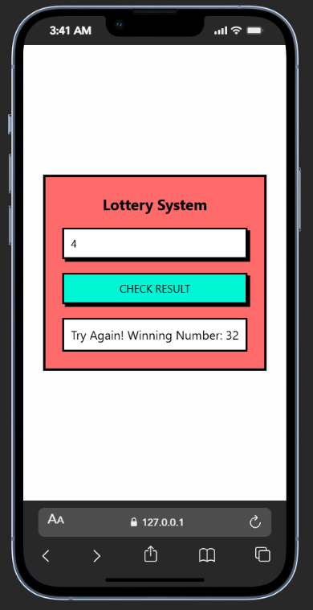
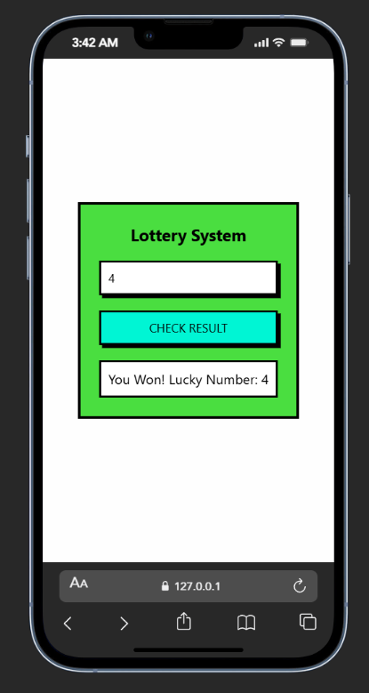

# 🎟️ Lottery System

🔗 **Live Demo:** https://lucky-faun-645c44.netlify.app/

A responsive, interactive **Lottery Number Checker** built with plain JavaScript, HTML, and CSS.  
Enter a number between **1 and 50** — if the randomly generated number matches your input, you win!

---

## 📌 Features

✅ User enters a number (1–50)  
✅ Random number generated using `Math.ceil()`  
✅ Result updates dynamically on the page  
✅ Displays “You Won” or “Try Again”  
✅ Neo-Brutalist UI design  
✅ Fully responsive using CSS `@media`

---

## 🧠 How It Works

1. User enters a number and clicks “CHECK RESULT”
2. A random number (1–50) is generated:
   const randomNumber = Math.ceil(Math.random() * 50);
3. If the random number equals user input:

   * Shows **“You Won”**
   * Card changes color to indicate success
4. If not:

   * Shows **“Try Again”**
   * Indicates losing outcome with color feedback

---

## 🚀 Technologies Used

* 🔹 HTML
* 🔹 CSS (Neo-Brutalist style)
* 🔹 JavaScript (DOM manipulation & logic)

No frameworks — 100% vanilla front-end!

---

## 🧩 Screenshots

## 🧩 Screenshots

### 📸 Desktop View



### 📱 Mobile View



---

## 🛠️ Installation (Local Development)

To run this project locally:

1. Clone the repository:

   ```bash
   git clone https://github.com/your-username/your-repo.git
   ```
2. Go to the project directory:

   ```bash
   cd your-repo
   ```
3. Open `index.html` in a browser

No server required — static site.

---

## 💡 Project Structure

```
📦 lottery-system
 ┣ 📜 index.html
 ┣ 📜 style.css
 ┣ 📜 script.js
 ┗ 📜 README.md
```

---

## 🔍 Future Enhancements

You can extend this project by:

* 🎉 Adding sound effects
* 🔄 Counting total wins/losses
* 💥 Adding animations on win/lose
* ⏱️ Timer for delays
* 🗑️ Reset button
* 🚫 Disable input after win

---

## 💬 Feedback

Feel free to open issues or request enhancements if hosted on GitHub.

---

## 📜 License

This project is open-source and free to use.

