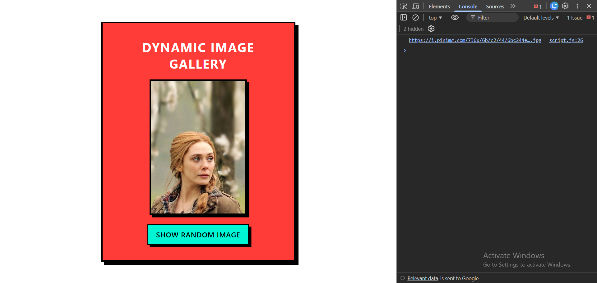
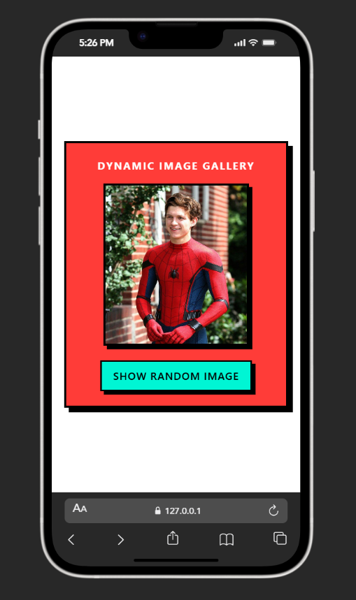

🎨 Dynamic Image Gallery

🔗 Live Demo: https://dynamic-image-gallerry.netlify.app/

A responsive, interactive Dynamic Image Gallery built with plain HTML, CSS, and JavaScript.
Click the button to generate a random portrait image styled in a bold Neo-Brutalist UI.

📌 Features

✅ Displays a random image on button click
✅ Images generated dynamically using document.createElement()
✅ Uses Math.floor() for random selection
✅ Old image removed before showing new one
✅ Portrait-safe cropping using object-position: top
✅ Neo-Brutalist UI design (thick borders & hard shadows)
✅ Fully responsive using CSS @media
✅ Clean Flexbox-centered layout

🧠 How It Works

Image URLs are stored in a JavaScript array.

When the user clicks “SHOW RANDOM IMAGE”:

const randomIndex = Math.floor(Math.random() * images.length);

A new  element is created dynamically.

The selected image is appended to the .gallery container.

Previous image is cleared using:

gallery.innerHTML = "";

CSS ensures responsive scaling and controlled cropping.

🚀 Technologies Used

🔹 HTML5

🔹 CSS3 (Flexbox + Media Queries)

🔹 JavaScript (DOM Manipulation)

No frameworks — 100% Vanilla Front-End 🚀

🎨 Design Style

This project follows Neo-Brutalism UI principles:

Bold background colors

Thick black borders

Hard offset shadows (no blur)

High contrast typography

Strong button interaction effect

🧩 Screenshots
📸 Desktop View

📱 Mobile View

📱 Responsive Behavior

Container scales using width: 90% + max-width

Image size adjusts using max-width

Uses aspect-ratio for proportional scaling

Media queries optimize layout for mobile screens

🛠️ Installation (Local Development)

To run this project locally:

Clone the repository:

git clone https://github.com/your-username/your-repo.git

Navigate into the folder:

cd your-repo

Open index.html in your browser

No server required — static project.

💡 Project Structure
📦 dynamic-image-gallery
 ┣ 📜 index.html
 ┣ 📜 style.css
 ┣ 📜 script.js
 ┗ 📜 README.md
