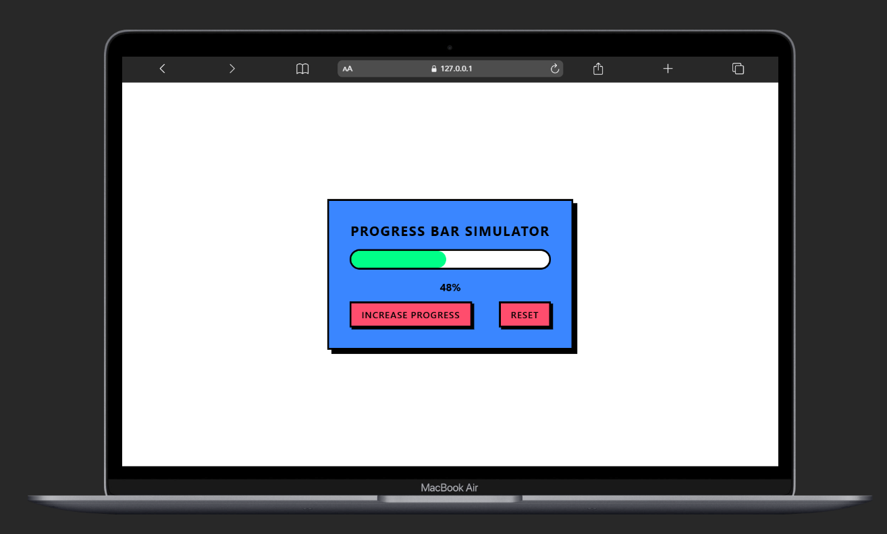
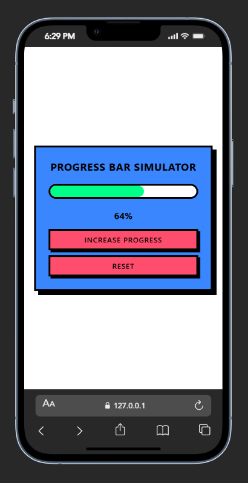

🚀 Neo-Brutal Progress Bar Simulator

🔗 Live Demo: https://your-live-link.netlify.app/

A responsive, interactive Progress Bar Simulator built using plain HTML, CSS, and JavaScript.
Click the button to increase progress randomly between 10%–30% until it reaches 100%.

Designed in bold Neo-Brutalism UI style with thick borders and hard shadows.

📌 Features

✅ Progress increases randomly between 10–30%
✅ Stops automatically at 100%
✅ Reset button to restart progress
✅ Width updated dynamically using JavaScript
✅ Percentage text updates in real-time
✅ Neo-Brutalist UI design (thick borders & hard shadows)
✅ Fully responsive using CSS @media
✅ Clean Flexbox-centered layout

🧠 How It Works

Progress is stored in a JavaScript variable:

let progress = 0;

When the user clicks Increase Progress:

let randomIncrease = Math.floor(Math.random() * 21) + 10;

This generates a random number between 10–30.

Progress is updated:

progress += randomIncrease;

If progress exceeds 100:

if (progress > 100) {
  progress = 100;
}

Then the UI updates dynamically:

progressBar.style.width = progress + "%";
percentage.innerText = progress + "%";

Reset button sets everything back to:

progress = 0;
🚀 Technologies Used

🔹 HTML5
🔹 CSS3 (Flexbox + Media Queries)
🔹 JavaScript (DOM Manipulation)

No frameworks — 100% Vanilla Front-End 🚀

🎨 Design Style

This project follows Neo-Brutalism UI principles:

Bold solid background colors
Thick black borders
Hard offset shadows (no blur)
High contrast typography
Strong button press effect
Blocky structured layout

🧩 Screenshots
📸 Desktop View

📱 Mobile View

