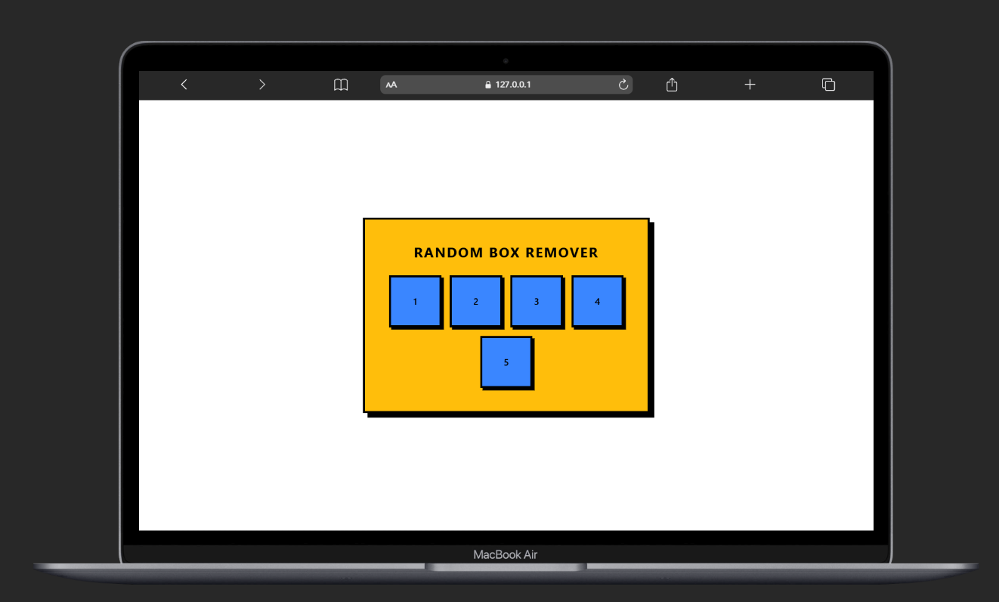
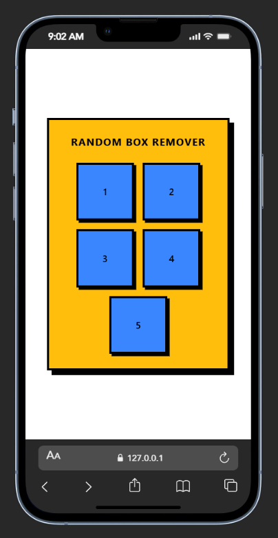

🟦 Random Box Remover

🔗 Live Demo: https://random-image-remover.netlify.app/

An interactive and responsive Random Box Remover built using plain HTML, CSS, and JavaScript.

Five boxes are created dynamically using JavaScript.
Each box gets a unique data-id.
Clicking a box removes only that specific box from the DOM.

Styled using bold Neo-Brutalism UI principles with thick borders and hard shadows.

📌 Features

✅ Creates 5 boxes dynamically using createElement()
✅ Assigns unique data-id using setAttribute()
✅ Identifies clicked box using getAttribute()
✅ Removes only the clicked box
✅ Uses Event Delegation (single parent listener)
✅ Neo-Brutalist UI design
✅ Fully responsive layout
✅ Clean Flexbox structure

🧠 How It Works
1️⃣ Boxes Created Dynamically
for (let i = 1; i <= 5; i++) {
    const box = document.createElement("div");
    box.classList.add("box");
    box.setAttribute("data-id", i);
    box.innerText = i;
    boxContainer.appendChild(box);
}

This loop:

Creates 5 
 elements

Assigns class .box

Adds unique data-id

Appends them inside #box-container

2️⃣ Detect Which Box Was Clicked

We use event delegation:

boxContainer.addEventListener("click", function (e) {
    if (e.target.classList.contains("box")) {
        const id = e.target.getAttribute("data-id");
        e.target.remove();
    }
});

✔ getAttribute("data-id") identifies the clicked box
✔ remove() deletes only that box

🚀 Technologies Used

🔹 HTML5
🔹 CSS3 (Flexbox + Media Queries)
🔹 JavaScript (DOM Manipulation)

No frameworks — 100% Vanilla Front-End 🚀

🎨 Design Style

This project follows Neo-Brutalism UI principles:

Bold background colors

Thick black borders

Hard offset shadows (no blur)

High contrast typography

Strong click interaction

📱 Responsive Behavior

Container scales using width: 90% + max-width

Boxes use aspect-ratio: 1/1 for square layout

flex-wrap allows automatic wrapping

Media queries optimize for small screens

Boxes adjust per screen size (4–5 per row → 2 per row on mobile)

🧩 Screenshots
📸 Desktop View

📱 Mobile View
