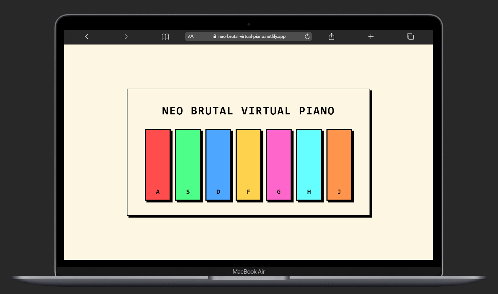

🎹 Neo Brutal Virtual Piano

🔗 Live Demo: https://neo-brutal-virtual-piano.netlify.app/

A responsive virtual piano built using HTML, CSS, and JavaScript with a bold Neo-Brutalism design.

Press keyboard keys or click on the piano keys to play sounds 🎵

🎯 Features

Keyboard support (A S D F G H J)

Clickable keys

Short piano note sounds

Neo-Brutal UI (thick borders + hard shadows)

Fully responsive

🖥 Desktop View

📸 Add your screenshot inside the project folder and name it screenshot.png

🧠 Key Mapping
Key	Note
A	C
S	D
D	E
F	F
G	G
H	A
J	B
🛠 Tech Used

HTML

CSS (Flexbox + Media Queries)

JavaScript (DOM + Audio API)